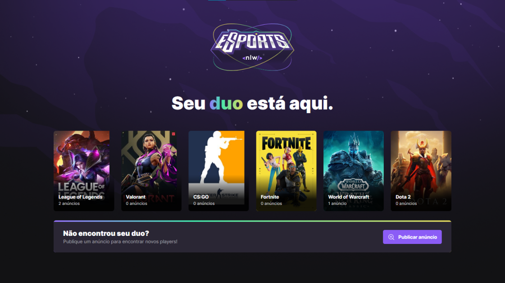

<h1 align="center">
    
</h1>

  

<h2>🎮 Sobre</h2>

O find your DUO-web é uma aplicação para ajudar pessoas a encontrarem parceiros em jogos online. Nele você pode criar um anúncio, contendo alguns dados (nome do jogo, dias da semana que você joga, discord, etc.), e este anúncio ficará publicado na plataforma, para que outras pessoas possam visualizar e se conectar com você através do Discord. Projeto realizado durante a Next Level Week da Rocketseat.

 
<h2>🎯 Objetivo</h2>

O find your DUO é o meu primeiro projeto Full Stack - Aplicação Web, API e aplicação Mobile (a API e a aplicação Mobile também estão no meu Github), e o fato dele ser Full Stack me ajudou a compreender ainda mais o funcionamento do Front-end, pois como eu desenvolvi o Back-End integrado com o Banco de dados, pude ver de perto de que forma os dados chegam a estes serviços, e de que forma eles processam essas informações e devolvem ao Front-End, e isso contruibuiu para eu ter uma nova visão, uma visão holística de uma aplicação web, facilitando futuros aprendizados na área.

 
<h2>🛠️ Tecnologias e ferramentas/bibliotecas utilizadas</h2>
<ul>
  <li><a href="https://pt-br.reactjs.org/">ReactJS</a></li>
    <li><a href="https://www.typescriptlang.org/">Typescript</a></li>
  <li><a href="https://tailwindcss.com/">TailwindCSS</a></li>
  <li><a href="https://www.radix-ui.com/">Radix-UI</a></li>
</ul>
 
<h2>📌 Funcionalidades a serem implementadas</h2>
<ul>
  <li>Aplicar responsividade para dispositivos móveis</li>
  <li>Criar a visualização dos anúncios por jogo</li>
  <li>Criar um componente de alerta, que será acionado quando o usuário cadastrar um novo anúncio</li>
  <li>Construir um componente de carrossel para os jogos</li>
</ul>
 
<h2>🔖 Layout</h2>

Você pode visualizar o layout do projeto através deste link: <a href="https://www.figma.com/community/file/1150897317533332617">Layout do projeto</a>. É necessário possuir uma conta no <a href="https://figma.com">Figma</a> para acessá-lo.

 
 

Made by Matheus Pazinati 🛸

